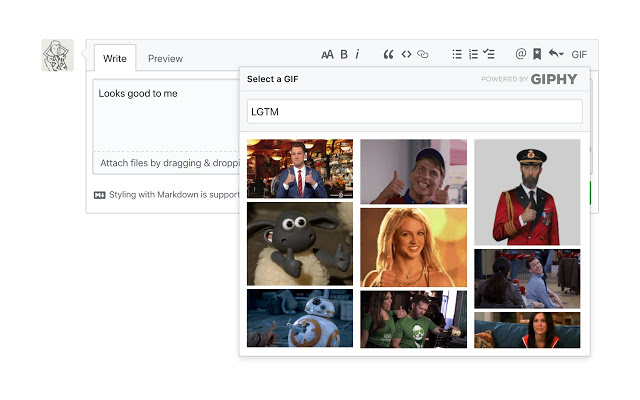
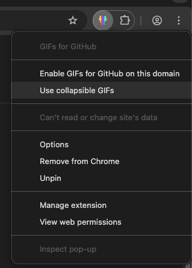
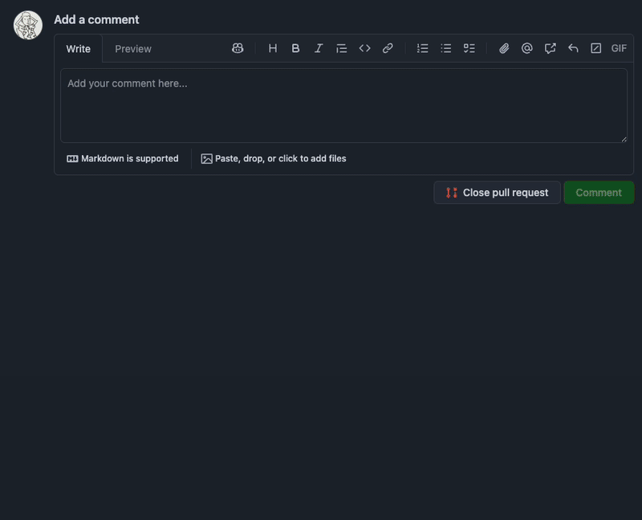
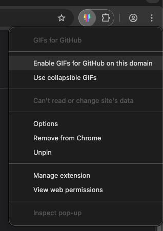
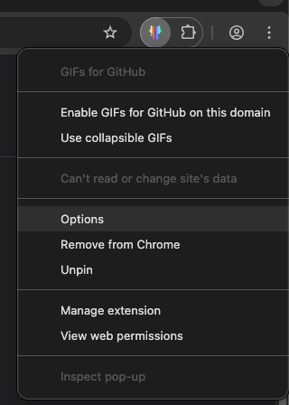
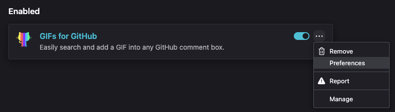
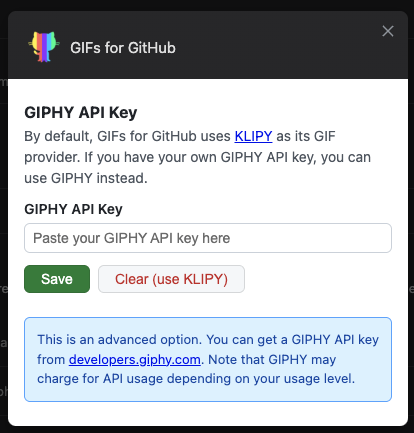

#  GIFs for GitHub

A Browser extension that makes it easy to search and add a GIF into any GitHub comment box.



---

## Install

[link-chrome]: https://chrome.google.com/webstore/detail/gifs-for-github/dkgjnpbipbdaoaadbdhpiokaemhlphep 'Version published on Chrome Web Store'
[link-firefox]: https://addons.mozilla.org/en-US/firefox/addon/gifs-for-github/ 'Version published on Mozilla Add-ons'

[][link-chrome] [][link-chrome]

[][link-firefox] [][link-firefox]

---

## Options

### Collapsible GIFs

Right-click the extension icon and select **Use collapsible GIFs** to wrap GIFs in a `<details>` block instead of embedding them inline.





### GitHub Enterprise

Right-click the extension icon on your GitHub Enterprise domain and select **Enable GIFs for GitHub on this domain** to enable the extension there.



### GIPHY API Key

By default the extension uses [KLIPY](https://klipy.com) as its GIF provider. If you have your own [GIPHY](https://developers.giphy.com) API key and would like to use GIPHY instead, open the extension's options page and paste your key there.

- **Chrome:** `chrome://extensions` → GIFs for GitHub → **Details → Extension options**
- **Firefox:** `about:addons` → GIFs for GitHub → **Preferences**







---

## Contributing

```sh
git clone https://github.com/N1ck/gifs-for-github
cd gifs-for-github
pnpm install
pnpm run build   # Output goes to distribution/
```

```sh
pnpm run watch   # Rebuild on file changes
```

### Project layout

| Path | Purpose |
| --- | --- |
| `src/` | Extension source (loaded by webpack) |
| `distribution/` | Build output (gitignored; load this in the browser) |
| `assets/` | Screenshots and GIFs for this README |
| `designs/` | Logo source files (Sketch) |

### Debug Mode

When developing, you can enable debug mode by setting the DEBUG environment variable:

```bash
DEBUG=true pnpm run build
```

This will output helpful logs prefixed with 🎨 when using the extension.

Once built, load it in the browser of your choice with [web-ext](https://github.com/mozilla/web-ext):

```sh
npx web-ext run --target=chromium # Open extension in Chrome
```

```sh
npx web-ext run # Open extension in Firefox
```

Or you can [load it manually in Chrome](https://www.smashingmagazine.com/2017/04/browser-extension-edge-chrome-firefox-opera-brave-vivaldi/#google-chrome-opera-vivaldi) or [Firefox](https://www.smashingmagazine.com/2017/04/browser-extension-edge-chrome-firefox-opera-brave-vivaldi/#mozilla-firefox).

---

If you want to read about why I built this extension, and some of the challenges I faced, check out my [blog post][link-blogpost].

[link-cws]: https://chrome.google.com/webstore/detail/gifs-for-github/dkgjnpbipbdaoaadbdhpiokaemhlphep?hl=en 'Version published on Chrome Web Store'
[link-amo]: https://addons.mozilla.org/en-US/firefox/addon/gifs-for-github/ 'Version published on Mozilla Add-ons'
[link-blogpost]: https://medium.com/we-build-vend/helping-engineers-gif-their-best-life-challenges-faced-when-building-the-gifs-for-github-f0cac9dd8fa5 "Helping Engineers GIF Their Best Life: Challenges Faced When Building the 'GIFs for GitHub' Extension"
